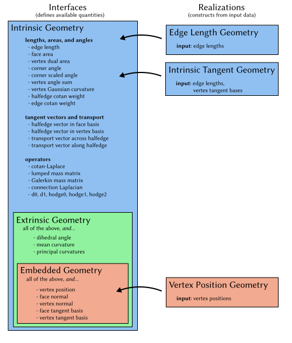

While the [halfedge mesh](../halfedge_mesh/basics.md) encodes the _connectivity_ of a surface, this section covers the classes which sit atop a halfedge mesh to define its _geometry_.

The first section below explains the class structure used to expose geometric logic, and the second section explains the system of automatically-cached quantities.

## Geometry hierarchy 


!!! TLDR "TL;DR"

    Construct a `VertexPositionGeometry` object using vertex positions; it offers all the geometric routines you would expect, and can be passed to any method that demands geometry.

    Many algorithms can actually operate on weaker data than vertex positions. Read on to learn more.


Geometry central is intentionally designed to allow flexibility in defining the geometry of a surface. Traditional code might assume a 3D position for every vertex, but many algorithms actually need only the _intrinsic geometry_ of a surface, aka the edge lengths. More generally, specifying algorithms to only use the geometric data they really need allows us to seamlessly leverage powerful techniques.

We (sparingly) make use of polymorphism via inheritance in C++ to encode a hierarchy of geometric quantities that one might compute for a surface. 

- **Interfaces** define which quantities can be computed from the geometry; for instance, an `EmbeddedGeometry` can compute face normals, and it can also compute face areas because it extends the more basic `IntrinsicGeometry`. Interfaces are abstract, and cannot be instantiated by themselves.
- **Realizations** are concrete classes that allow the user instantiate a geometry object from data; for instance, a `VertexPositionGeometry` can be constructed from vertex positions, and implements the `EmbeddedGeometry` giving access to a wide range of intrinsic and extrinsic geometric quantities.

The following diagram outlines the interfaces and realizations currently available.



## Quantity management

### Immediate computation
In the most basic usage, geometric quantities can be immediately computed for a given element from input data. For instance, `double IntrinsicGeometry::faceArea(Face f)` will compute the area of a face.  However, this is _not_ the typical intended method for working with geometric quantities in geometry central.

### Managed quantities
A common pattern in geometry code is to maintain precomputed arrays of values that are used repeatedly (e.g. vertex normals). However, naive use of this pattern requires the programmer to coordinate these arrays throughout their codebase, or risk computing and storing the same array many times in distant subroutines. Geometry central embraces this pattern, and provides automatic support for it.

All geometry objects automatically maintain of system of caches for geometric quantities; the user can simply call (for instance) `geometry.requireFaceAreas()` at the beginning of a subroutine to ensure that the face area buffer is populated, then access `geometry.faceAreas[f]` in any subsequent code. This strategy keep storage and computation to a minimum by sharing repeated values across any use of the geometry object.

The following example demonstrates immediate computation vs cached quantities.
```cpp
EmbeddedGeometry& geometry = /* ... */;

// bad: immediate computation everywhere
for(Vertex v : mesh->vertices()) {
	Vector3 normal = geometry.vertexNormal(v);
}

// good: automatic caching and storage
geometry.requireVertexNormals();
for(Vertex v : mesh->vertices()) {
	Vector3 normal = geometry.vertexNormals[v];
}
```

These managed quantities are the primary intended method for working with geometric data, and should be preferred over immediate computation whenever possible.

#### Dependencies
In addition, dependencies between these quantities are managed internally; for instance, if vertex normals are requested, face normals will be internally populated and used to compute vertex normals. However, these dependencies are internal and subject to change; the programmer should always explicitly call `geometry.requireFaceNormals()` if they intend to access face normals.

#### Updating
If the underlying geometric data changes (e.g., vertices are moved or the mesh is mutated), invoking `geometry->refreshQuantities()` will recompute all required values.

#### Minimizing storage usage
To minimize memory usage, invoke `geometry.unrequireFaceNormals()` at the conclusion of a subroutine to indicate that the quantity is no longer needed, decrementing an internal counter. The quantity is not instantly deleted after being un-required, but invoking `geometry.purgeQuantities()` will delete any quantities that are not currently required, reducing memory usage. Most users find that un-requiring and purging quantities is not necessary, and one can simply allow them to accumulate and eventually be deleted with the geometry object.

#### Quantity API

`#include "geometrycentral/surface/geometry.h"` to get all geometry interfaces.

All quantities offer methods and storage following the same naming pattern. For a quantity named `YYYs` (e.g. `faceAreas`), which is defined in an interface `GeometryInterface` (e.g. `IntrinsicGeometry`) the pattern is given below. All available quantities are listed in [quantities](quantities.md).

??? func "`#!cpp MeshData<> GeometryInterface::YYYs`"
    The member variable array for quantity YYY. Initially empty, but can be populated with `requireYYYs()` below.

    For instance, for the quantity face areas, there is a member `FaceData<double> IntrinsicGeometry::faceAreas`.

??? func "`#!cpp void GeometryInterface::requireYYYs()`"
    Request that the buffer for quantity YYYs be populated. If it is already populated the method will return right away, otherwise the quantity will be computed.

    For instance, for the quantity face areas, one would call `IntrinsicGeometry::requireFaceAreas()`.

??? func "`#!cpp void GeometryInterface::unrequireYYYs()`"

    Indicate that the buffer for quantity YYYs no longer needs to be populated. Internally decrements a counter; once there is a `unrequireYYYs()` for every `requireYYYs()` call, the quantity can be purged by `GeometryInterface::purgeQuantities()`.

    For instance, for the quantity face areas, one would call `IntrinsicGeometry::unrequireFaceAreas()`.

    Note: most users find that un-requiring and purging quantities is not necessary, and one can simply allow them to accumulate and eventually be deleted with the geometry object. This functionality can be used only if reducing memory usage is very important.

??? func "`#!cpp T GeometryInterface::computeYYY(Element e)`"

    Immediate computation: rather than using the caching system described above, directly compute the value from the input data. 

    Only available for quantities which can be easily computed in O(1) from inputs (e.g. face normals), but not for quantities with significant dependencies (e.g. vertex normals, which depend on all incident face normals).

    For instance, face areas can be immediately computed with `double IntrinsicGeometry::computeFaceArea(Face f)`.

    **Note:** immediate computation is generally discouraged, prefer using managed quantities instead.

In addition, the caching system provides two methods.

??? func "`#!cpp void GeometryInterface::refreshQuantities()`"
    Recompute all required quantities from the input geometric data.

    Should be called, for instance if vertices are moved or the underlying mesh is mutated.

??? func "`#!cpp void GeometryInterface::purgeQuantities()`"
    Recompute all required quantities from the input geometric data.

    Should be called, for instance if vertices are moved or the underlying mesh is mutated.

    Note: most users find that un-requiring and purging quantities is not necessary, and one can simply allow them to accumulate and eventually be deleted with the geometry object. This functionality can be used only if reducing memory usage is very important.


